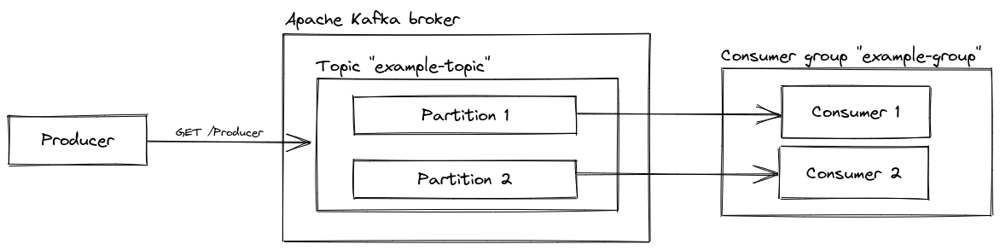

# .NET Apache Kafka playground
Playground for testing the [Apache Kafka](https://kafka.apache.org/) event streaming platform using [Confluent's Apache Kafka .NET client](https://github.com/confluentinc/confluent-kafka-dotnet).

## Getting started
Run `docker compose up -d` in the main directory to start Apache Kafka. After that, you  can run the `Producer` and up to two `Consumer`s with `dotnet run` in the corresponding project directory.

To add a message to the queue, go to `https://localhost:7060/Producer` or trigger the producer via the Swagger-UI: `https://localhost:7060/swagger`.

## Setup
The Apache Kafka instance is configured to start with a single topic called `example-topic` with **2 partitions** and **1 replication** (see line `example-topic:2:1` in the `docker-compose.yml`). This allows us to start two consumer applications that process the messages of the topic `example-topic` concurrently.

  

In one consumer group, each partition will be processed by one consumer only. If the number of consumers is less than the number of topic partitions, then multiple partitions will be assigned to one of the consumers in the group. If the number of consumers is, however, higher than the number of topic partitions, then one consumer might not get any messages at all.

This is example demonstrates the use of two consumers at the same time.
